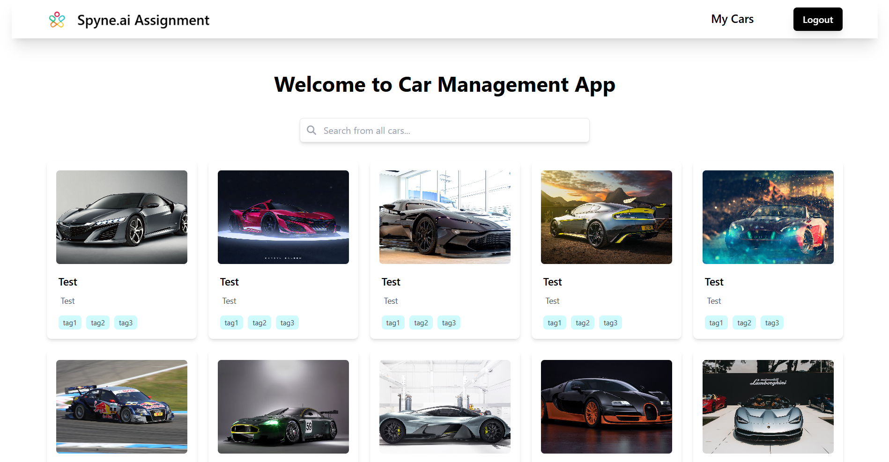

# Spyne.ai Assignment Submission ✅

### Live Link: [spyne-ai-assignment.deepanshu-sahu-projects.live](spyne-ai-assignment.deepanshu-sahu-projects.live)



### Postman Workspace: [Workspace Link](https://www.postman.com/flight-physicist-9054540/workspace/spyne-ai-assignment)


## Overview

This Car Management Application is designed to enable users to efficiently manage their cars with functionalities for creation, viewing, editing, and deletion. Each car record includes a title, description, tags (e.g., car type, company, dealer), and up to 10 images. The application integrates user authentication, ensuring users can only manage their own cars, and features a robust global search functionality to locate cars based on keywords in titles, descriptions, or tags.

## Implementation

This Car Management Application is built using a modern web development stack that integrates both frontend and backend components for seamless functionality. The backend exposes RESTful APIs to manage user authentication and car-related operations, while the frontend leverages a dynamic UI to interact with the backend services. The application follows a secure user authentication flow, ensuring that users can only manage their own cars.

## Backend Implementation:
- **Node.js & Express**: The backend is built with Node.js and Express, handling all the API requests for user authentication, car management, and search functionality.
- **MongoDB**: A NoSQL database is used to store user data and car information, including details like titles, descriptions, tags, and images.
- **Multer**: A middleware used to handle car image uploads, allowing users to upload up to 10 images per car.
- **JWT Authentication**: JSON Web Tokens (JWT) are used for secure user authentication and ensuring that only authorized users can perform actions on their cars.
- **API Documentation**: The APIs are documented using Postman, providing detailed information about request parameters, authentication requirements, and response formats.


## Frontend Implementation:
- **React**: The frontend is developed using React, which offers a dynamic and responsive interface for managing cars and user sessions.
- **Tailwind CSS**: A utility-first CSS framework is used to style the application, providing a modern, clean, and responsive design.

## Key Functionalities

### User Authentication:
- Users can register (sign up) and log in to the application using their credentials.
- Authentication is handled via **JWT** tokens to secure user sessions and prevent unauthorized access to car data.

### Car Creation:
- Users can create a new car by uploading up to 10 images, providing a title, description, and tags (e.g., car type, company, dealer).
- Car images are handled using **Multer** to manage the file uploads.

### Car List Page:
- Displays all the cars created by the logged-in user in a list format.
- Provides a search bar to filter cars by title, description, or tags, using global search functionality.

### Car Detail Page:
- Users can click on any car to view its details, including its images, title, description, and tags.
- The page provides options to edit or delete the car.

### Edit Car:
- Users can update any aspect of their car details, including title, description, tags, and images.
- The images are uploaded again using **Multer** if the user chooses to update them.

### Delete Car:
- Users can delete their cars from the database, removing the car’s information and associated images.

## API Endpoints:
- **Create User**: Allows users to register a new account.
- **Create Car**: Adds a new car with details (title, description, tags, and images).
- **List Car**: Retrieves all cars created by the logged-in user.
- **View Particular Car**: Displays a specific car’s details.
- **Update Car**: Updates the details of a car.
- **Delete CAR**: Deletes a car from the user’s list.

## API Documentation:
- The API endpoints are documented for easy integration and testing using tools like **Postman**.

## Deployment:
- The app is deployed on a cloud platform **Vercel**, ensuring reliable access to the application for both the frontend and backend services.

## Installation and Setup

Follow these steps to get the project running locally:

### Steps:

1. **Clone the Repository**:

   ```bash
   git clone https://github.com/dee077/Spyne_ai_assignment.git
   ```

2. **Install Frontend Dependencies:**:

   ```bash
   cd frontend
   npm install
   ```

3. **Install Backend Dependencies:**:

   ```bash
   cd ../backend
   npm install
   ```
4. **Create .env file**:

   ```bash
   MONGO_URI=<Your_MongoDB_URI>   
   PORT=5000
   PORT=5000
   JWT_SECRET=<Your_Jwt_Secret_> 
   CLOUDINARY_CLOUD_NAME=<Your_Cloudinary_Cloud_Name> 
   CLOUDINARY_API_KEY=<Your_Cloudinary_Api_Key> 
   CLOUDINARY_API_SECRET=<Your_Cloudinary_Api_Secret> 
   ```

4. **Start Backend and Frontend**:
   In Terminal 1:
   ```bash
   cd frontend
   npm start
   ```
   In Terminal 2:
   ```bash
   cd backend
   npm start
   ```
   Access the app at `http://localhost:3000` and keep the backend running on `http://localhost:5000`.
   Change DOMAIN in `frontend/src/utls.js` to `http://localhost:5000` to serve from local backend.


## Submission

I have completed the assignment as per the given requirements and it is ready for submission. <br>
Thank you! <br>
Deepanshu Sahu